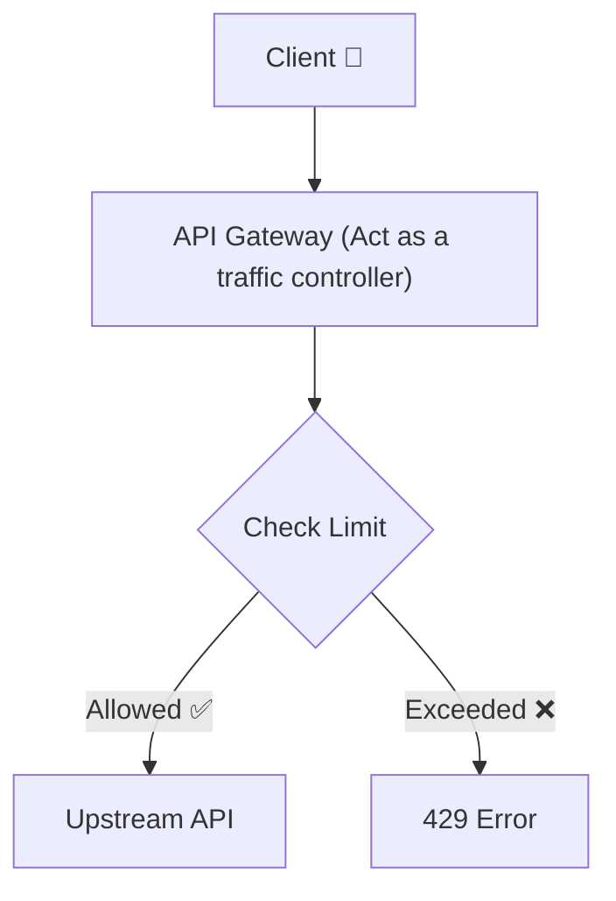

# ⚡ rater

A high-performance, zero-allocation rate limiting library and API Gateway middleware for Go.



## 📌 Features

* 🧮 **Multiple Algorithms:** Token Bucket, Sliding Window Log, and Sliding Window Counter.
* 🌐 **Distributed Engine:** Atomic Redis Lua script execution for multi-node deployments.
* ⚡ **High Performance:** Up to 20M+ ops/sec with `0 B/op` memory allocations.
* 🔌 **HTTP Middleware:** Seamless integration with Go's standard `net/http` stack and reverse proxies.
* 🐳 **Containerized:** Ready-to-use `Dockerfile` and `docker-compose.yml` for instant deployment.

---

## 📊 Performance Benchmarks (Apple M2 Pro)

```text
BenchmarkSlidingWindowCounter-12   20660607    54.09 ns/op    0 B/op    0 allocs/op
BenchmarkTokenBucket-12            20305267    57.36 ns/op    0 B/op    0 allocs/op
BenchmarkSlidingWindowLog-12       17969002    66.91 ns/op    7 B/op    0 allocs/op
```

## Start up
- Update service address and port
```
docker-compose up --build
```